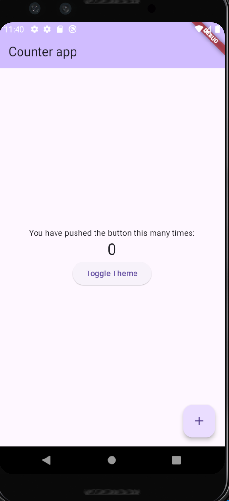
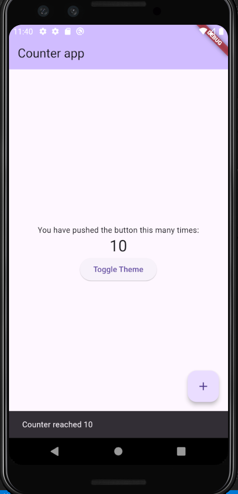
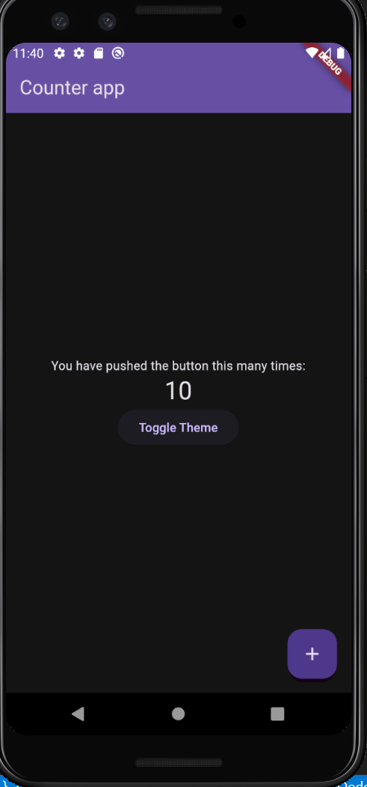

# Counter and Theme Toggle App  

A Flutter application demonstrating the use of **Flutter Bloc** with multiple Cubits for managing state. The app allows users to:  
- Increment a counter.  
- Toggle between light and dark themes.  

## 📋 Description  

This app showcases the use of `MultiBlocProvider` to manage multiple Cubits:  
- **CounterCubit**: Handles the counter value.  
- **ThemeCubit**: Toggles between light and dark themes.  

## 🚀 Features  

- Increment a counter with a floating action button.  
- Display a message when the counter reaches 10.  
- Toggle between light and dark themes dynamically.  

## 🛠️ Technologies Used  

- **Framework**: Flutter  
- **State Management**: Flutter Bloc (Cubit pattern)  
- **Language**: Dart

## 🏗️ Project Structure
```plain text
lib  
├── cubits  
│   ├── counter  
│   │   └── counter_cubit.dart   # CounterCubit for managing counter state  
│   ├── theme  
│       └── theme_cubit.dart     # ThemeCubit for managing theme state  
├── main.dart                    # Application entry point  

```

## 📚 How It Works
### State Management

1. **CounterCubit**
    
    - Maintains an integer counter state.
    - Provides a `incrementCounter` method to increase the counter.
    - Emits a new state when the counter is updated.
2. **ThemeCubit**
    
    - Maintains the current theme state (light or dark).
    - Provides a `toggleTheme` method to switch between light and dark themes.
    - Emits a new theme state upon toggling.

### Notifications

- A `SnackBar` is displayed when the counter reaches 10.

### UI Behavior

- The floating action button increments the counter.
- The "Toggle Theme" button switches between light and dark themes.

### 🎨 Screenshots




